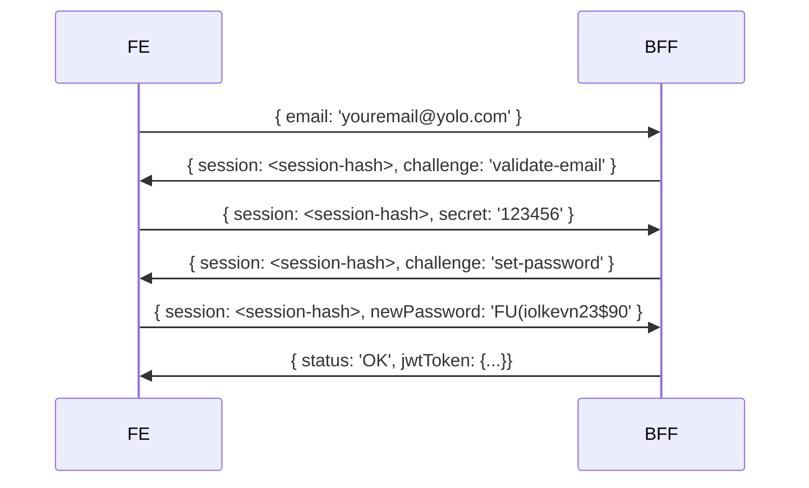

# Kerno's DevX Challenge

Howdy 👋  We are glad you made it!

We are in the hunt for strong full-stack typescript developers to join our Developer Experience team! You are proficient in React and have a strong engineering mindset. You understand the depth of web technologies, data structures, communication protocols and architectures, state management and have passion (and good eye) for building absolutely mind-blowing, 2024-worthy user experiences.  
  
You can autonomously work on your BFF with Node.js consuming data services from databases, pubsubs and other services provided by the data teams.  

**And don't be shy!**
We place great value in education and experience; but we also recognize that talent is built on passion and hours dedicated to deliberate practice and learning... so don't shy away from applying if you feel you have what it takes!

## The challenge:
You need to build an authentication screen and its supporting API with React and Node.js
The module needs to support MFA via email besides the usual user/password set.

Here is the expected flow in a nutshell:
- A user comes to the login page and enters its email
- If no user with the required email exists, just create it
- If the user has not been active for more than 7 days, ask for a one-time-password
	- It must be 6 digits, the API should print it in console.log for challenge validation purpose
- If the user has no password (was newly created), ask for a new password and set it
	- On success, return the JWT tokens to be further used by the user
- If the user has a password, ask for the password. 
	-  On success, return the JWT tokens to be further used by the user

You are free to structure the API, style the UI and add whatever you see fit to deliver (from libraries to animations to backend frameworks). There are no restrictions on your weapons of choice as long as you stay within the React+Node.js universe.

### Visual guideline
Here's a little example flow in case you need a little push to get going:

---

### Clone this project!
Once you are happy with it, zip it and send it to dev-challenges@kerno.io for us to review.

The repository already contains a usable skeleton for the react application and express API setup with [NX](https://nx.dev). Feel free to change it for a Next and/or Nest frontend or backend if you are more comfortable with those frameworks.
